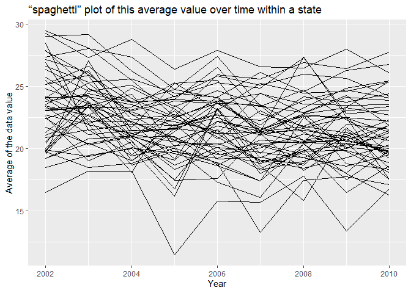
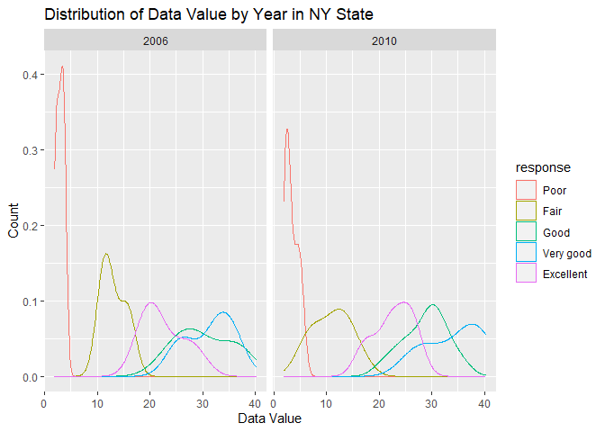

p8105_hw3_rl3401
================
Ruoxi Li
2023-10-05

``` r
library(tidyverse)
```

    ## ── Attaching core tidyverse packages ──────────────────────── tidyverse 2.0.0 ──
    ## ✔ dplyr     1.1.3     ✔ readr     2.1.4
    ## ✔ forcats   1.0.0     ✔ stringr   1.5.0
    ## ✔ ggplot2   3.4.3     ✔ tibble    3.2.1
    ## ✔ lubridate 1.9.2     ✔ tidyr     1.3.0
    ## ✔ purrr     1.0.2     
    ## ── Conflicts ────────────────────────────────────────── tidyverse_conflicts() ──
    ## ✖ dplyr::filter() masks stats::filter()
    ## ✖ dplyr::lag()    masks stats::lag()
    ## ℹ Use the conflicted package (<http://conflicted.r-lib.org/>) to force all conflicts to become errors

\##problem 2

``` r
library(p8105.datasets)
data("brfss_smart2010") 
```

``` r
brfss_df <- brfss_smart2010 |>
  janitor::clean_names() |>
  filter( topic== "Overall Health",
          response %in% c("Excellent","Very good","Good","Fair","Poor")
            ) |>
  mutate(response = fct_relevel(response, "Poor", "Fair", "Good", "Very good", "Excellent"))
```

``` r
brfss_df |>
  group_by(year,locationabbr)|>
  summarize(n_obs = n()) |>
  filter(year == 2002, n_obs >= 7)
```

    ## `summarise()` has grouped output by 'year'. You can override using the
    ## `.groups` argument.

    ## # A tibble: 36 × 3
    ## # Groups:   year [1]
    ##     year locationabbr n_obs
    ##    <int> <chr>        <int>
    ##  1  2002 AZ              10
    ##  2  2002 CO              20
    ##  3  2002 CT              35
    ##  4  2002 DE              15
    ##  5  2002 FL              35
    ##  6  2002 GA              15
    ##  7  2002 HI              20
    ##  8  2002 ID              10
    ##  9  2002 IL              15
    ## 10  2002 IN              10
    ## # ℹ 26 more rows

In 2002, which states were observed at 7 or more locations? 36.

``` r
brfss_df |>
  group_by(year,locationabbr)|>
  summarize(n_obs = n()) |>
  filter(year == 2010, n_obs >= 7)
```

    ## `summarise()` has grouped output by 'year'. You can override using the
    ## `.groups` argument.

    ## # A tibble: 45 × 3
    ## # Groups:   year [1]
    ##     year locationabbr n_obs
    ##    <int> <chr>        <int>
    ##  1  2010 AL              15
    ##  2  2010 AR              15
    ##  3  2010 AZ              15
    ##  4  2010 CA              60
    ##  5  2010 CO              35
    ##  6  2010 CT              25
    ##  7  2010 DE              15
    ##  8  2010 FL             205
    ##  9  2010 GA              20
    ## 10  2010 HI              20
    ## # ℹ 35 more rows

What about in 2010? 45.

Construct a dataset that is limited to Excellent responses, and
contains, year, state, and a variable that averages the data_value
across locations within a state. Make a “spaghetti” plot of this average
value over time within a state (that is, make a plot showing a line for
each state across years – the geom_line geometry and group aesthetic
will help).

``` r
excellent_df = 
  brfss_df|>
  filter(response == "Excellent") 
excellent_df |>
  group_by(year,locationabbr)|>
  summarize(mean_data_value = mean(data_value, na.rm= TRUE)) |>    
  ggplot(aes(x=year,y=mean_data_value,group=locationabbr))+
  geom_line()+
  labs(x = "Year", y = "Average of the data value", title = "“spaghetti” plot of this average value over time within a state ")
```

    ## `summarise()` has grouped output by 'year'. You can override using the
    ## `.groups` argument.

<!-- -->

Make a two-panel plot showing, for the years 2006, and 2010,
distribution of data_value for responses (“Poor” to “Excellent”) among
locations in NY state

``` r
brfss_df |>
  filter(locationabbr == "NY", year %in% c(2006,2010))|>
  ggplot(aes(x = data_value, color = response)) +
  facet_grid(.~ year) +
  geom_density(alpha = 0.5) +
  labs(x = "Data Value", y = "Count", title = "Distribution of Data Value by Year in NY State") 
```

<!-- --> \##
problem 3
