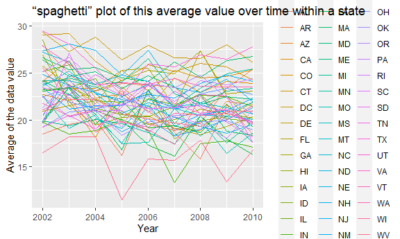
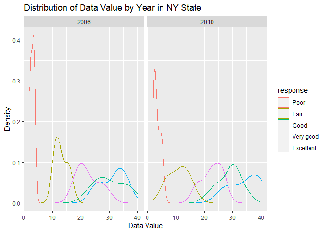
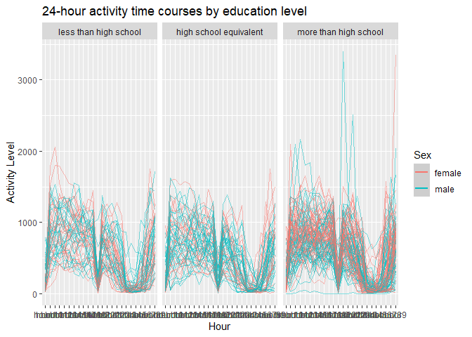

p8105_hw3_rl3401
================
Ruoxi Li
2023-10-08

``` r
library(tidyverse)
```

    ## ── Attaching core tidyverse packages ──────────────────────── tidyverse 2.0.0 ──
    ## ✔ dplyr     1.1.3     ✔ readr     2.1.4
    ## ✔ forcats   1.0.0     ✔ stringr   1.5.0
    ## ✔ ggplot2   3.4.3     ✔ tibble    3.2.1
    ## ✔ lubridate 1.9.2     ✔ tidyr     1.3.0
    ## ✔ purrr     1.0.2     
    ## ── Conflicts ────────────────────────────────────────── tidyverse_conflicts() ──
    ## ✖ dplyr::filter() masks stats::filter()
    ## ✖ dplyr::lag()    masks stats::lag()
    ## ℹ Use the conflicted package (<http://conflicted.r-lib.org/>) to force all conflicts to become errors

\##problem 2

``` r
library(p8105.datasets)
data("brfss_smart2010") 
```

``` r
brfss_df <- brfss_smart2010 |>
  janitor::clean_names() |>
  filter( topic== "Overall Health",
          response %in% c("Excellent","Very good","Good","Fair","Poor")
            ) |>
  mutate(response = fct_relevel(response, "Poor", "Fair", "Good", "Very good", "Excellent"))
```

``` r
brfss_df |>
  group_by(year,locationabbr)|>
  summarize(n_obs = n()) |>
  filter(year == 2002, n_obs >= 7)
```

    ## `summarise()` has grouped output by 'year'. You can override using the
    ## `.groups` argument.

    ## # A tibble: 36 × 3
    ## # Groups:   year [1]
    ##     year locationabbr n_obs
    ##    <int> <chr>        <int>
    ##  1  2002 AZ              10
    ##  2  2002 CO              20
    ##  3  2002 CT              35
    ##  4  2002 DE              15
    ##  5  2002 FL              35
    ##  6  2002 GA              15
    ##  7  2002 HI              20
    ##  8  2002 ID              10
    ##  9  2002 IL              15
    ## 10  2002 IN              10
    ## # ℹ 26 more rows

In 2002, which states were observed at 7 or more locations? 36.

``` r
brfss_df |>
  group_by(year,locationabbr)|>
  summarize(n_obs = n()) |>
  filter(year == 2010, n_obs >= 7)
```

    ## `summarise()` has grouped output by 'year'. You can override using the
    ## `.groups` argument.

    ## # A tibble: 45 × 3
    ## # Groups:   year [1]
    ##     year locationabbr n_obs
    ##    <int> <chr>        <int>
    ##  1  2010 AL              15
    ##  2  2010 AR              15
    ##  3  2010 AZ              15
    ##  4  2010 CA              60
    ##  5  2010 CO              35
    ##  6  2010 CT              25
    ##  7  2010 DE              15
    ##  8  2010 FL             205
    ##  9  2010 GA              20
    ## 10  2010 HI              20
    ## # ℹ 35 more rows

What about in 2010? 45.

Construct a dataset that is limited to Excellent responses, and
contains, year, state, and a variable that averages the data_value
across locations within a state. Make a “spaghetti” plot of this average
value over time within a state (that is, make a plot showing a line for
each state across years – the geom_line geometry and group aesthetic
will help).

``` r
excellent_df = 
  brfss_df|>
  filter(response == "Excellent") 
excellent_df |>
  group_by(year,locationabbr)|>
  summarize(mean_data_value = mean(data_value, na.rm= TRUE)) |>    
  ggplot(aes(x=year,y=mean_data_value,group=locationabbr))+
  geom_line()+
  labs(x = "Year", y = "Average of the data value", title = "“spaghetti” plot of this average value over time within a state ")
```

    ## `summarise()` has grouped output by 'year'. You can override using the
    ## `.groups` argument.

<!-- -->

Make a two-panel plot showing, for the years 2006, and 2010,
distribution of data_value for responses (“Poor” to “Excellent”) among
locations in NY state

``` r
brfss_df |>
  filter(locationabbr == "NY", year %in% c(2006,2010))|>
  ggplot(aes(x = data_value, color = response)) +
  facet_grid(.~ year) +
  geom_density(alpha = 0.5) +
  labs(x = "Data Value", y = "Count", title = "Distribution of Data Value by Year in NY State") 
```

<!-- -->

## problem 3

``` r
accel_df = read_csv("data/nhanes_accel.csv")|>
  janitor::clean_names()
```

    ## Rows: 250 Columns: 1441
    ## ── Column specification ────────────────────────────────────────────────────────
    ## Delimiter: ","
    ## dbl (1441): SEQN, min1, min2, min3, min4, min5, min6, min7, min8, min9, min1...
    ## 
    ## ℹ Use `spec()` to retrieve the full column specification for this data.
    ## ℹ Specify the column types or set `show_col_types = FALSE` to quiet this message.

``` r
covar_df = read_csv("data/nhanes_covar.csv",skip = 4)|>
  janitor::clean_names()
```

    ## Rows: 250 Columns: 5
    ## ── Column specification ────────────────────────────────────────────────────────
    ## Delimiter: ","
    ## dbl (5): SEQN, sex, age, BMI, education
    ## 
    ## ℹ Use `spec()` to retrieve the full column specification for this data.
    ## ℹ Specify the column types or set `show_col_types = FALSE` to quiet this message.

``` r
baseline_df =
covar_df |>
  drop_na()|>
  filter(age >= 21)|>
  mutate(
      sex = case_match(
      sex,
      1 ~ "male",
      2 ~ "female"),
      education = case_match(
        education,
        1 ~ "less than high school",
        2 ~ "high school equivalent",
        3 ~ "more than high school"
      ))|>
  mutate(education = fct_relevel(education, "less than high school", "high school equivalent", "more than high school"))
```

Produce a reader-friendly table for the number of men and women in each
education category

``` r
baseline_df |>
  group_by(sex,education)|>
  summarize(n_obs=n())|>
  pivot_wider(
    names_from = education,
    values_from = n_obs
  )|>
  knitr::kable()
```

    ## `summarise()` has grouped output by 'sex'. You can override using the `.groups`
    ## argument.

| sex    | less than high school | high school equivalent | more than high school |
|:-------|----------------------:|-----------------------:|----------------------:|
| female |                    28 |                     23 |                    59 |
| male   |                    27 |                     35 |                    56 |

and create a visualization of the age distributions for men and women in
each education category. Comment on these items.

``` r
baseline_df|>
  ggplot(aes(x=age,color=sex))+
  geom_density()+
  facet_grid(.~education)
```

<!-- -->

``` r
total_activity_df = accel_df|>
  pivot_longer(
    cols = starts_with("min"),
               names_to = "time",
               values_to = "accel")|>
  group_by(seqn)|>
  summarize(total_activity=sum(accel))
```

``` r
total_activity_plot_df = inner_join(baseline_df,total_activity_df,by="seqn") 
total_activity_plot_df|>
  ggplot(aes(x=age,y=total_activity,color=sex))+
  facet_grid(.~education)+
  geom_point()+
  geom_smooth()
```

    ## `geom_smooth()` using method = 'loess' and formula = 'y ~ x'

<!-- -->

``` r
hour_df = accel_df|>
   pivot_longer(
    cols = starts_with("min"),
               names_to = "time",
               values_to = "accel")|>
   mutate(hour = case_when(
    time %in% paste0("min", 1:60) ~ "hour1",
    time %in% paste0("min", 61:120) ~ "hour2",
    time %in% paste0("min", 121:180) ~ "hour3",
    time %in% paste0("min", 181:240) ~ "hour4",
    time %in% paste0("min", 241:300) ~ "hour5",
    time %in% paste0("min", 301:360) ~ "hour6",
    time %in% paste0("min", 361:420) ~ "hour7",
    time %in% paste0("min", 421:480) ~ "hour8",
    time %in% paste0("min", 481:540) ~ "hour9",
    time %in% paste0("min", 541:600) ~ "hour10",
    time %in% paste0("min", 601:660) ~ "hour11",
    time %in% paste0("min", 661:720) ~ "hour12",
    time %in% paste0("min", 721:780) ~ "hour13",
    time %in% paste0("min", 781:840) ~ "hour14",
    time %in% paste0("min", 841:900) ~ "hour15",
    time %in% paste0("min", 901:960) ~ "hour16",
    time %in% paste0("min", 961:1020) ~ "hour17",
    time %in% paste0("min", 1021:1080) ~ "hour18",
    time %in% paste0("min", 1081:1140) ~ "hour19",
    time %in% paste0("min", 1141:1200) ~ "hour20",
    time %in% paste0("min", 1201:1260) ~ "hour21",
    time %in% paste0("min", 1261:1320) ~ "hour22",
    time %in% paste0("min", 1321:1380) ~ "hour23",
    time %in% paste0("min", 1381:1440) ~ "hour24",
    TRUE ~ as.character(time)
  )
   ) |>
    group_by(seqn,hour)|>
  summarize(hour_total=sum(accel))
```

    ## `summarise()` has grouped output by 'seqn'. You can override using the
    ## `.groups` argument.

``` r
hour_plot_df = inner_join(baseline_df, hour_df, by = "seqn")


hour_plot_df |>
ggplot( aes(x = hour, y = hour_total, color = sex)) +
  geom_line(aes(group = seqn), alpha = 0.5)   +
  geom_smooth() +
  facet_grid(.~education)+
  labs(title = "24-hour activity time courses by education level",
       x = "Hour",
       y = "Activity Level",
       color = "Sex") 
```

    ## `geom_smooth()` using method = 'loess' and formula = 'y ~ x'

<!-- -->
