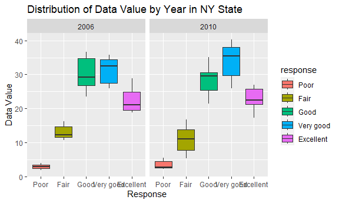
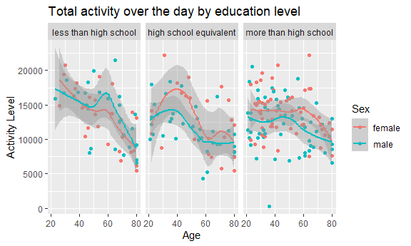

p8105_hw3_rl3401
================
Ruoxi Li
2023-10-12

``` r
library(tidyverse)
```

    ## ── Attaching core tidyverse packages ──────────────────────── tidyverse 2.0.0 ──
    ## ✔ dplyr     1.1.3     ✔ readr     2.1.4
    ## ✔ forcats   1.0.0     ✔ stringr   1.5.0
    ## ✔ ggplot2   3.4.3     ✔ tibble    3.2.1
    ## ✔ lubridate 1.9.2     ✔ tidyr     1.3.0
    ## ✔ purrr     1.0.2     
    ## ── Conflicts ────────────────────────────────────────── tidyverse_conflicts() ──
    ## ✖ dplyr::filter() masks stats::filter()
    ## ✖ dplyr::lag()    masks stats::lag()
    ## ℹ Use the conflicted package (<http://conflicted.r-lib.org/>) to force all conflicts to become errors

## Problem 1

``` r
library(p8105.datasets)
data("instacart")
```

*This is a dataset with 15 columns and 1384617 rows. The variables
include order_id, product_id, add_to_cart_order, reordered, user_id,
eval_set, order_number, order_dow, order_hour_of_day,
days_since_prior_order, product_name, aisle_id, department_id, aisle,
department.*

*Here is an example of observations.*

| order_id | product_id | add_to_cart_order | reordered | user_id | eval_set | order_number | order_dow | order_hour_of_day | days_since_prior_order | product_name     | aisle_id | department_id | aisle  | department |
|---------:|-----------:|------------------:|----------:|--------:|:---------|-------------:|----------:|------------------:|-----------------------:|:-----------------|---------:|--------------:|:-------|:-----------|
|        1 |      49302 |                 1 |         1 |  112108 | train    |            4 |         4 |                10 |                      9 | Bulgarian Yogurt |      120 |            16 | yogurt | dairy eggs |

*This means :*

*The user with user_id “112108” has placed an order with order_id “1” .
The product “Bulgarian Yogurt” (product_id: 49302) is the first item in
the cart. It is categorized under the “yogurt” aisle (aisle_id: 120)
within the “dairy eggs” department (department_id: 16).*

*This isn’t the user’s first time ordering this product. It is the 4th
order sequence for the user. The day of the week on which the order was
placed is “4”, the hour of the day on which the order was placed is
“10”. It has been 9 days since the user’s previous order.*

``` r
count_aisle = 
  count(instacart,aisle)|>
  arrange(-n)

  head(count_aisle,n=1)
```

    ## # A tibble: 1 × 2
    ##   aisle                 n
    ##   <chr>             <int>
    ## 1 fresh vegetables 150609

``` r
nrow(count_aisle)
```

    ## [1] 134

*There are 134 aisles, the most items are ordered from the aisle fresh
vegetables.*

``` r
count_aisle |>
  filter(n > 10000)|>
  mutate(aisle = fct_reorder(aisle, -n))|>
  ggplot(aes(x=aisle, y=n))+ 
  geom_col() +
  theme(axis.text.x = element_text(angle = 45, hjust = 1)) +
  labs(title = "Items ordered from each aisle", x = "Aisle", y = "Number of items")
```

<!-- -->

*This is a plot that shows the number of items ordered in each aisle,
limiting this to aisles with more than 10000 items ordered.*

``` r
top_items = instacart |>
  filter(aisle %in% c("baking ingredients", "dog food care", "packaged vegetables fruits")) |>
  group_by(aisle, product_name) |>
  summarize(times_ordered = n()) |>
  arrange(aisle, -times_ordered) |>
  slice_head(n = 3) |>
  knitr::kable()
```

    ## `summarise()` has grouped output by 'aisle'. You can override using the
    ## `.groups` argument.

| aisle                      | product_name                                  | times_ordered |
|:---------------------------|:----------------------------------------------|--------------:|
| baking ingredients         | Light Brown Sugar                             |           499 |
| baking ingredients         | Pure Baking Soda                              |           387 |
| baking ingredients         | Cane Sugar                                    |           336 |
| dog food care              | Snack Sticks Chicken & Rice Recipe Dog Treats |            30 |
| dog food care              | Organix Chicken & Brown Rice Recipe           |            28 |
| dog food care              | Small Dog Biscuits                            |            26 |
| packaged vegetables fruits | Organic Baby Spinach                          |          9784 |
| packaged vegetables fruits | Organic Raspberries                           |          5546 |
| packaged vegetables fruits | Organic Blueberries                           |          4966 |

*This is a table showing the three most popular items in each of the
aisles “baking ingredients”, “dog food care”, and “packaged vegetables
fruits”.*

``` r
mean_hour = instacart |>
  filter(product_name %in% c("Pink Lady Apples", "Coffee Ice Cream")) |>
  group_by(product_name, order_dow) |>
  summarize(mean_hour = mean(order_hour_of_day)) |>
  pivot_wider(
               names_from = order_dow, values_from = mean_hour
  )|>
    knitr::kable()
```

    ## `summarise()` has grouped output by 'product_name'. You can override using the
    ## `.groups` argument.

| product_name     |        0 |        1 |        2 |        3 |        4 |        5 |        6 |
|:-----------------|---------:|---------:|---------:|---------:|---------:|---------:|---------:|
| Coffee Ice Cream | 13.77419 | 14.31579 | 15.38095 | 15.31818 | 15.21739 | 12.26316 | 13.83333 |
| Pink Lady Apples | 13.44118 | 11.36000 | 11.70213 | 14.25000 | 11.55172 | 12.78431 | 11.93750 |

*This is a table showing the mean hour of the day at which Pink Lady
Apples and Coffee Ice Cream are ordered on each day of the week.*

## problem 2

``` r
library(p8105.datasets)
data("brfss_smart2010") 
```

``` r
brfss_df <- brfss_smart2010 |>
  janitor::clean_names() |>
  filter( topic== "Overall Health",
          response %in% c("Excellent","Very good","Good","Fair","Poor")
            ) |>
  mutate(response = factor(response, 
                           levels =c("Poor", "Fair", "Good", "Very good", "Excellent"))
         )
```

``` r
brfss_df |>
  group_by(year, locationabbr) |>
  summarize(n_locations = n_distinct(locationdesc)) |>
   filter(year == 2002, n_locations >= 7) |>
    arrange(-n_locations)
```

    ## `summarise()` has grouped output by 'year'. You can override using the
    ## `.groups` argument.

    ## # A tibble: 6 × 3
    ## # Groups:   year [1]
    ##    year locationabbr n_locations
    ##   <int> <chr>              <int>
    ## 1  2002 PA                    10
    ## 2  2002 MA                     8
    ## 3  2002 NJ                     8
    ## 4  2002 CT                     7
    ## 5  2002 FL                     7
    ## 6  2002 NC                     7

*In 2002, states observed at 7 or more locations were PA, MA, NJ, CT,
FL, NC. PA has the most observed locations as 10.*

``` r
brfss_df |>
  group_by(year, locationabbr) |>
  summarize(n_locations = n_distinct(locationdesc)) |>
   filter(year == 2010, n_locations >= 7) |>
    arrange(-n_locations)
```

    ## `summarise()` has grouped output by 'year'. You can override using the
    ## `.groups` argument.

    ## # A tibble: 14 × 3
    ## # Groups:   year [1]
    ##     year locationabbr n_locations
    ##    <int> <chr>              <int>
    ##  1  2010 FL                    41
    ##  2  2010 NJ                    19
    ##  3  2010 TX                    16
    ##  4  2010 CA                    12
    ##  5  2010 MD                    12
    ##  6  2010 NC                    12
    ##  7  2010 NE                    10
    ##  8  2010 WA                    10
    ##  9  2010 MA                     9
    ## 10  2010 NY                     9
    ## 11  2010 OH                     8
    ## 12  2010 CO                     7
    ## 13  2010 PA                     7
    ## 14  2010 SC                     7

*In 2010, states observed at 7 or more locations were FL, NJ, TX, CA,
MD, NC, NE, WA, MA, NY, OH, CO, PA,SC. FL has the most observed
locations as 41.*

Construct a dataset that is limited to Excellent responses, and
contains, year, state, and a variable that averages the data_value
across locations within a state. Make a “spaghetti” plot of this average
value over time within a state:

``` r
  brfss_df|>
  filter(response == "Excellent") |>
  group_by(year,locationabbr)|>
  summarize(mean_data_value = mean(data_value, na.rm= TRUE)) |>    
  ggplot(aes(x=year,y=mean_data_value,group=locationabbr,color=locationabbr))+
  geom_line()+
  labs(x = "Year", y = "Average of the data value", title = "“spaghetti” plot of this average value over time within a state ")
```

    ## `summarise()` has grouped output by 'year'. You can override using the
    ## `.groups` argument.

<!-- -->

*This is a “spaghetti” plot of this average value over time within a
state limited to Excellent responses. At a glance, there appears to be a
consistent trend across states.*

*However, due to the sheer number of overlapping lines representing each
state, distinguishing between them becomes challenging. This density
impedes a clear and definitive interpretation of the data.*

Make a two-panel plot showing, for the years 2006, and 2010,
distribution of data_value for responses (“Poor” to “Excellent”) among
locations in NY state:

``` r
brfss_df |>
  filter(locationabbr == "NY", year %in% c(2006,2010))|>
  ggplot(aes(x = response, y =  data_value,fill=response)) +
  facet_grid(.~ year) +
  geom_boxplot()+
  labs(x = "Response", y = "Data Value", title = "Distribution of Data Value by Year in NY State") 
```

<!-- -->

*This is a two-panel plot showing, for the years 2006, and 2010,
distribution of data_value for responses (“Poor” to “Excellent”) among
locations in NY state. *

*For both years, the median ranking is as follows: ‘Very good’ holds the
highest median, followed by ‘Good’, ‘Excellent’, ‘Fair’, and then
‘Poor’.the distribution in the ‘Very good’ category is left-skewed, the
distribution in the ‘Excellent’ category is right-skewed.*

## problem 3

Load, tidy, merge, and otherwise organize the data sets:

``` r
accel_df = read_csv("data/nhanes_accel.csv")|>
  janitor::clean_names()|>
   pivot_longer(
    cols = starts_with("min"),
               names_to = "time",
               values_to = "accel")
```

    ## Rows: 250 Columns: 1441
    ## ── Column specification ────────────────────────────────────────────────────────
    ## Delimiter: ","
    ## dbl (1441): SEQN, min1, min2, min3, min4, min5, min6, min7, min8, min9, min1...
    ## 
    ## ℹ Use `spec()` to retrieve the full column specification for this data.
    ## ℹ Specify the column types or set `show_col_types = FALSE` to quiet this message.

``` r
covar_df = read_csv("data/nhanes_covar.csv",skip = 4)|>
  janitor::clean_names() |>
  drop_na()|>
  filter(age >= 21)|>
  mutate(
      sex = case_match(
      sex,
      1 ~ "male",
      2 ~ "female"),
      education = case_match(
        education,
        1 ~ "less than high school",
        2 ~ "high school equivalent",
        3 ~ "more than high school"
      ))|>
  mutate(education = fct_relevel(education, "less than high school", "high school equivalent", "more than high school"))
```

    ## Rows: 250 Columns: 5
    ## ── Column specification ────────────────────────────────────────────────────────
    ## Delimiter: ","
    ## dbl (5): SEQN, sex, age, BMI, education
    ## 
    ## ℹ Use `spec()` to retrieve the full column specification for this data.
    ## ℹ Specify the column types or set `show_col_types = FALSE` to quiet this message.

Produce a reader-friendly table for the number of men and women in each
education category:

``` r
covar_df |>
  group_by(sex,education)|>
  summarize(n_obs=n())|>
  pivot_wider(
    names_from = education,
    values_from = n_obs
  )|>
  knitr::kable()
```

    ## `summarise()` has grouped output by 'sex'. You can override using the `.groups`
    ## argument.

| sex    | less than high school | high school equivalent | more than high school |
|:-------|----------------------:|-----------------------:|----------------------:|
| female |                    28 |                     23 |                    59 |
| male   |                    27 |                     35 |                    56 |

Create a visualization of the age distributions for men and women in
each education category.

``` r
covar_df|>
  ggplot(aes(x=age,color=sex))+
  geom_density()+
  facet_grid(.~education)
```

<!-- -->

*Comment*

``` r
total_activity_df = accel_df|>
  group_by(seqn)|>
  summarize(total_activity=sum(accel))
```

Plot - Total activity over the day:

``` r
total_activity_plot_df = inner_join(covar_df,total_activity_df,by="seqn") 
total_activity_plot_df|>
  ggplot(aes(x=age,y=total_activity,color=sex))+
  facet_grid(.~education)+
  geom_point()+
  geom_smooth()+
   labs(title = "Total activity over the day by education level",
       x = "Age",
       y = "Activity Level",
       color = "Sex") 
```

    ## `geom_smooth()` using method = 'loess' and formula = 'y ~ x'

<!-- -->

*comment*

Plot - 24-hour activity time courses：

``` r
hour24_plot_df = inner_join(covar_df, accel_df, by = "seqn")


hour24_plot_df |>
ggplot( aes(x = time, y = accel, color = sex)) +
  geom_point( alpha = 0.5)   +
  geom_smooth() +
  facet_grid(.~education)+
  labs(title = "24-hour activity time courses by education level",
       x = "Minute",
       y = "Activity Level",
       color = "Sex") 
```

    ## `geom_smooth()` using method = 'loess' and formula = 'y ~ x'

<!-- -->

*Describe in words any patterns or conclusions you can make based on
this graph*
